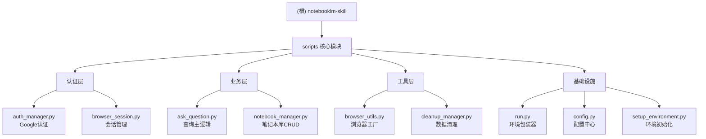

# NotebookLM Claude Code Skill

> 更新时间：2025-12-07 13:12:46

## 项目愿景

本项目是一个 Claude Code Skill，旨在让 Claude Code 能够直接与 Google NotebookLM 进行交互，获取基于用户上传文档的、有引用支持的源知识库答案。通过浏览器自动化技术，实现了从文档查询到代码生成的无缝工作流。

## 架构总览

### 技术架构图

```mermaid
graph TD
    A["(根) NotebookLM Skill"] --> B["scripts"];
    A --> C["data"];
    A --> D["references"];
    A --> E["images"];
    A --> F[".spec-workflow"];
    A --> G[".claude-flow"];
    A --> H[".swarm"];

    B --> B1["ask_question.py<br/>查询接口"];
    B --> B2["auth_manager.py<br/>认证管理"];
    B --> B3["notebook_manager.py<br/>笔记本库管理"];
    B --> B4["browser_session.py<br/>浏览器会话"];
    B --> B5["browser_utils.py<br/>浏览器工具"];
    B --> B6["cleanup_manager.py<br/>数据清理"];
    B --> B7["config.py<br/>配置中心"];
    B --> B8["run.py<br/>环境包装器"];
    B --> B9["setup_environment.py<br/>环境初始化"];

    C --> C1["library.json<br/>笔记本元数据"];
    C --> C2["auth_info.json<br/>认证信息"];
    C --> C3["browser_state/<br/>浏览器状态"];

    D --> D1["api_reference.md<br/>API文档"];
    D --> D2["troubleshooting.md<br/>故障排除"];
    D --> D3["usage_patterns.md<br/>使用模式"];

    click B1 "./scripts/CLAUDE.md#ask_questionpy" "查看查询接口文档"
    click B2 "./scripts/CLAUDE.md#auth_managerpy" "查看认证管理文档"
    click B3 "./scripts/CLAUDE.md#notebook_managerpy" "查看笔记本管理文档"
```



### 核心架构特点

1. **模块化设计** - 代码已重构为清晰的模块，每个脚本有单一职责
2. **环境隔离** - 使用 `.venv` 确保依赖隔离，通过 `run.py` 统一管理
3. **混合认证** - 持久化浏览器配置文件 + 手动 Cookie 注入解决 Playwright Bug
4. **无状态会话** - 每个查询独立运行，通过后续提问机制获取完整信息
5. **智能浏览器** - 使用真实 Chrome + 隐身技术避免检测

## ✨ 模块结构图



## 模块索引

| 模块路径 | 语言 | 主要职责 | 入口文件 | 测试覆盖 | 文档状态 |
|---------|------|----------|----------|----------|----------|
| **scripts/** | Python | 核心功能实现 | run.py | ❌ 无 | ✅ 完整 |
| **data/** | JSON | 数据存储 | library.json | N/A | ✅ 完整 |
| **references/** | Markdown | 扩展文档 | api_reference.md | N/A | ✅ 完整 |
| **images/** | PNG | 示例图片 | example_notebookchat.png | N/A | ✅ 完整 |
| **.spec-workflow/** | Markdown | 工作流模板 | user-templates/ | N/A | ⚠️ 未分析 |
| **.claude-flow/** | JSON | 性能指标 | performance.json | N/A | ⚠️ 未分析 |
| **.swarm/** | DB | 内存数据库 | memory.db | N/A | ⚠️ 未分析 |

## 运行与开发

### 环境要求

- Python 3.8+
- Google Chrome (非 Chromium)
- Claude Code (本地版本)

### 快速开始

```bash
# 1. 安装到 Claude Code skills 目录
mkdir -p ~/.claude/skills
cd ~/.claude/skills
git clone https://github.com/PleasePrompto/notebooklm-skill notebooklm

# 2. 在 Claude Code 中使用
"What skills do I have?"
"Set up NotebookLM authentication"
"Add this notebook to my library: [URL]"
```

### 开发指南

1. **所有命令必须使用 run.py 包装器**
   ```bash
   # ✅ 正确
   python scripts/run.py ask_question.py --question "..."

   # ❌ 错误 - 会在没有 venv 的情况下失败
   python scripts/ask_question.py --question "..."
   ```

2. **模块化设计原则**
   - `config.py` - 集中管理所有配置
   - `browser_utils.py` - 可复用的浏览器操作
   - 各脚本职责单一，避免重复代码

3. **安全注意事项**
   - `data/` 目录包含敏感信息，已加入 `.gitignore`
   - 绝不提交认证数据或用户笔记本信息

## 测试策略

### 当前测试覆盖
- **单元测试**: ❌ 无
- **集成测试**: ❌ 无
- **端到端测试**: ✅ 通过手动使用验证

### 建议的测试改进
1. 为 `config.py` 创建配置验证测试
2. 为 `notebook_manager.py` 创建 CRUD 操作测试
3. 为 `auth_manager.py` 创建认证状态测试
4. 创建模拟 NotebookLM 响应的测试环境

## 编码规范

### Python 代码规范
- 使用 Python 3.8+ 类型注解
- 遵循 PEP 8 风格指南
- 使用 Path 处理文件路径
- 异常处理使用具体的异常类型

### 模块设计原则
- 单一职责 - 每个模块只做一件事
- 依赖注入 - 通过参数传递依赖
- 配置外置 - 所有配置在 `config.py`
- 错误明确 - 提供清晰的错误信息

## AI 使用指引

### 技术栈分析
- **核心语言**: Python (100%)
- **浏览器自动化**: Patchright (Playwright 的分支)
- **状态管理**: JSON 文件存储
- **认证方案**: 混合认证（持久化配置 + Cookie 注入）

### 架构决策记录
1. **为什么使用 Patchright 而非 Selenium**
   - 更好的反检测能力
   - 内置等待机制
   - 更稳定的浏览器控制

2. **为什么选择无状态会话**
   - Skill 架构限制 - 每次调用独立
   - 通过后续提问机制弥补
   - 避免会话管理的复杂性

3. **为什么需要 run.py 包装器**
   - 自动创建和管理 `.venv`
   - 确保依赖正确安装
   - 提供统一的入口点

### 常见问题解决
1. **认证失败**
   - 检查 Chrome 是否为真实版本
   - 确保浏览器可见度设为 false（登录时）
   - 清理 browser_state 目录重试

2. **查询超时**
   - v1.3.0 已将超时提升至 120 秒
   - 检查网络连接
   - 查看 NotebookLM 是否正常运行

3. **答案不完整**
   - 等待 "thinking-message" 消失
   - 使用稳定性检测（3次连续检查）
   - 通过后续提问机制补充

## 变更记录 (Changelog)

### 2025-12-07 13:12:46
- ✨ 创建项目根文档
- 📊 分析项目架构和技术栈
- 🔗 建立模块导航结构
- 📝 整理开发指南和最佳实践

### 关键版本 (基于 CHANGELOG.md)
- **v1.3.0 (2025-11-21)** - 模块化架构重构，超时提升，思考消息检测修复
- **v1.2.0 (2025-10-28)** - 初始公开版本，基础功能实现

---

*提示：点击上方 Mermaid 图表中的节点可快速跳转到对应模块的详细文档。*